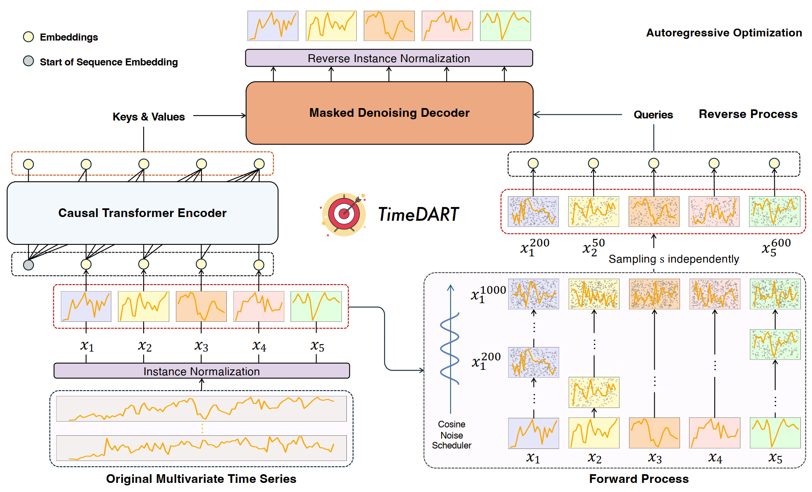
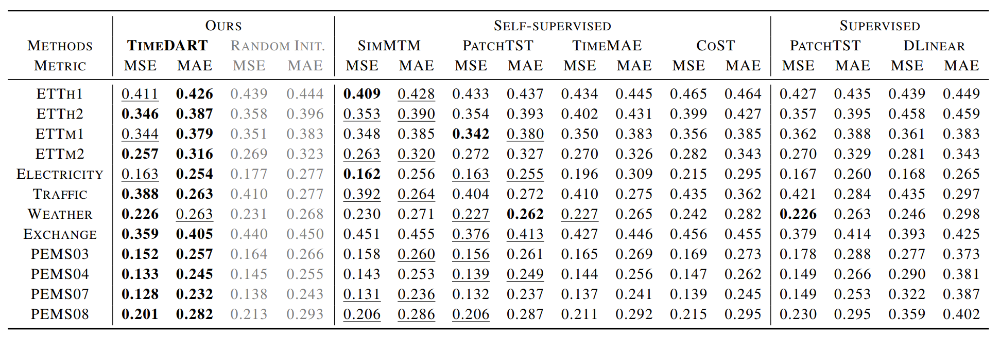
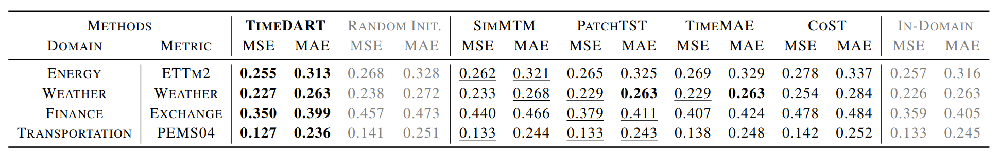
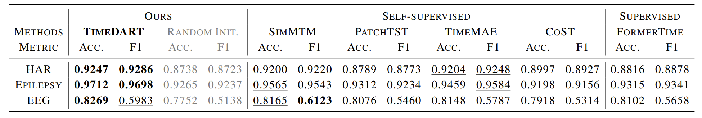

<div align="center">
  <h1>
        🎯 TimeDART: A Diffusion Autoregressive Transformer <br> for Self-Supervised Time Series Representation <br> [ICML 2025] 
  </h1> 
</div>

<div align="center">
  <a href="https://arxiv.org/abs/2410.05711">
    📖 <strong>Paper</strong>
  </a> |
  <a href="https://drive.google.com/drive/folders/19P---oV4nQ53JgKnE0VX3t_N1jLliVSv?usp=drive_link">
    📊 <strong>Datasets</strong>
  </a> |
  <a href="https://icml.cc/virtual/2025/poster/43701">
    📸 <strong>Poster</strong>
  </a> |
  <a href="https://icml.cc/virtual/2025/poster/43701">
    🌈 <strong>Slide</strong>
  </a> |
  <a href="https://recorder-v3.slideslive.com/#/share?share=101481&s=cb30d33d-2ae1-472d-ade2-81905c3da429"> 
    📽️ <strong>SlidesLive</strong> </a>
  <br><br>
  
  
  
  
</div>

---

## 📖 Abstract

**TimeDART** is a novel self-supervised time series pre-training framework that **unifies causal Transformer-based global modeling and denoising diffusion-based local pattern learning**. This approach enables more transferable representations by capturing both **long-term dynamics and fine-grained local features**, consistently outperforming previous methods on forecasting and classification tasks.

This repository contains the official code for our [paper](https://arxiv.org/abs/2410.05711):
> TimeDART: A Diffusion Autoregressive Transformer for Self-Supervised Time Series Representation 
> Daoyu Wang, Mingyue Cheng$^*$, Zhiding Liu, Qi Liu

<details>
<summary><b>Full Abstract</b></summary>

Self-supervised learning has garnered increasing attention in time series analysis for benefiting various downstream tasks and reducing reliance on labeled data. Despite its effectiveness, existing methods **often struggle to comprehensively capture both long-term dynamic evolution and subtle local patterns in a unified manner**. In this work, we propose **TimeDART**, a novel self-supervised time series pre-training framework that **unifies two powerful generative paradigms to learn more transferable representations**. Specifically, we first employ a **causal Transformer encoder**, accompanied by a patch-based embedding strategy, to model the **evolving trends from left to right**. Building on this global modeling, we further introduce a **denoising diffusion process** to capture fine-grained local patterns through forward diffusion and reverse denoising. Finally, we optimize the model in an **autoregressive manner**. As a result, TimeDART effectively accounts for both global and local sequence features in a coherent way. We conduct extensive experiments on public datasets for time series forecasting and classification. The experimental results demonstrate that **TimeDART consistently outperforms previous compared methods**, validating the effectiveness of our approach.

</details>

## 🎁 Updates/News:

🚩 **Updates** (Jun. 2025): TimeDART-v2 Expands Qwen2.5-0.5B as backbone network.

🎉 **News** (May. 2025): **TimeDART has been accepted by ICML 2025**.

🚩 **Updates** (Jan. 2025): TimeDART is being improved, refactored, and reviewed.

🚩 **News** (Oct. 2024): TimeDART initialized.


## 🌟 Overview

<div align="center">

<p><em>Figure 1: Overview of the TimeDART.</em></p>
</div>

**TimeDART** is a self-supervised framework for time series representation that processes data through three main modules：
1. It starts with **Instance Normalization and Patch Embedding**, where multivariate time series are instance-normalized and converted into non-overlapping patches. 
2. A **Causal Transformer Encoder** then models temporal patterns by applying a causal mask, ensuring information flow from left to right. 
3. This is followed by a **Patch-level Diffusion and Denoising process**, where noise is independently added to patches using a cosine scheduler, and a denoising decoder reconstructs the original data.

The Self-supervised Optimization Objective uses a **diffusion loss** instead of traditional MSE to capture the **complex, multimodal nature of real-world time series data**.


## ⚙️ Key Features

- **Motivation (Single Diffusion)**: Diffusion models often yield suboptimal results for downstream tasks and lack causal dependency.
- **Motivation (Single Autoregressive)**: Autoregressive methods can overfit noise and collapse predictions into a simple Gaussian distribution.
- **Unified Generative Paradigms**: TimeDART unifies autoregressive modeling for long-term trends and denoising diffusion for fine-grained local patterns.
- **Diffusion Loss**: Replaces MSE with a diffusion loss to capture richer, multimodal beliefs over time series data, addressing limitations of the Gaussian assumption.
- **Empirical Superiority**: Consistently outperforms previous methods in forecasting and classification across diverse public datasets.


## 🚀 Quick Start

### 1. Environment

We recommend using **Python 3.10+** and setting up a clean environment via `conda`:

```bash
conda create -n timedart python==3.10
conda activate time-r1

cd <YOUR WORKING DIR>
git clone https://github.com/Melmaphother/TimeDART.git

# Install from requirements
cd TimeDART
pip install -r requirements.txt
```

### 2. Datasets and Models

First, the training and evaluation datasets used in our experiments can be found in [Google Drive](https://drive.google.com/drive/folders/19P---oV4nQ53JgKnE0VX3t_N1jLliVSv?usp=drive_link). Then, create a directory named `datasets` and then download the necessary datasets into it.

```bash
# Make sure your working space is TimeDART
mkdir datasets
```

If you want to use **Qwen2.5-0.5B** as backbone. you should download this model and specify its location in the training script.

```bash
# Recommand for huggingface
pip install -U "huggingface_hub[cli]"
huggingface-cli download Qwen/Qwen2.5-0.5B --local-dir <WHATEVER YOU LIKE>

# Or you can use modelscope
pip install -U modelscope
modelscope download --model Qwen/Qwen2.5-0.5B --local_dir <WHATEVER YOU LIKE>
```


### 3. Training and Evaluation

TimeDART: We provide the default hyper-parameter settings in `scripts/prertrain` to perform pretraining, and ready-to-use scripts for fine-tuning on each datasets in `scripts/finetune`.

```bash
sh scripts/pretrain/ETTh2.sh && sh scripts/finetune/ETTh2.sh
```

TimeDART-v2: We use Qwen2.5-0.5B as backbone.

```bash
# Specify model path
python -u run.py \
    ...\
    --llm_path <YOUR MODEL PATH>\
    ...

sh scripts/qwen_pt/ETTh2.sh && sh scripts/qwen_ft/ETTh2.sh
```

## 💪 Performance

### 📈 Forecasting

**In-Domain:**


**Cross-Domain:**


### 🗂️ Classification



## 🙏 Acknowledgement

This repo is built on the pioneer works. We appreciate the following GitHub repos a lot for their valuable code base or datasets:

- [Time-Series-Library](https://github.com/thuml/Time-Series-Library)

- [GPHT](https://github.com/icantnamemyself/GPHT/tree/main)

- [SimMTM](https://github.com/thuml/simmtm)


## 🔖 Citation

>🙋 Please let us know if you find out a mistake or have any suggestions!
>
>🌟 If you find our work helpful, please consider to star this repository and cite our research.

```bibtex
@inproceedings{wang2025timedart,
  title={TimeDART: A Diffusion Autoregressive Transformer for Self-Supervised Time Series Representation},
  author={Daoyu Wang and Mingyue Cheng and Zhiding Liu and Qi Liu},
  booktitle={Forty-second International Conference on Machine Learning},
  year={2025},
  url={https://arxiv.org/abs/2410.05711},
}
```
