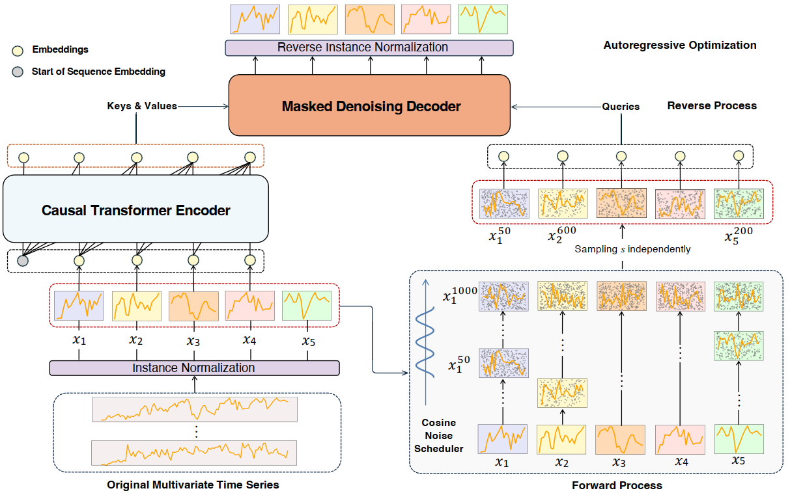
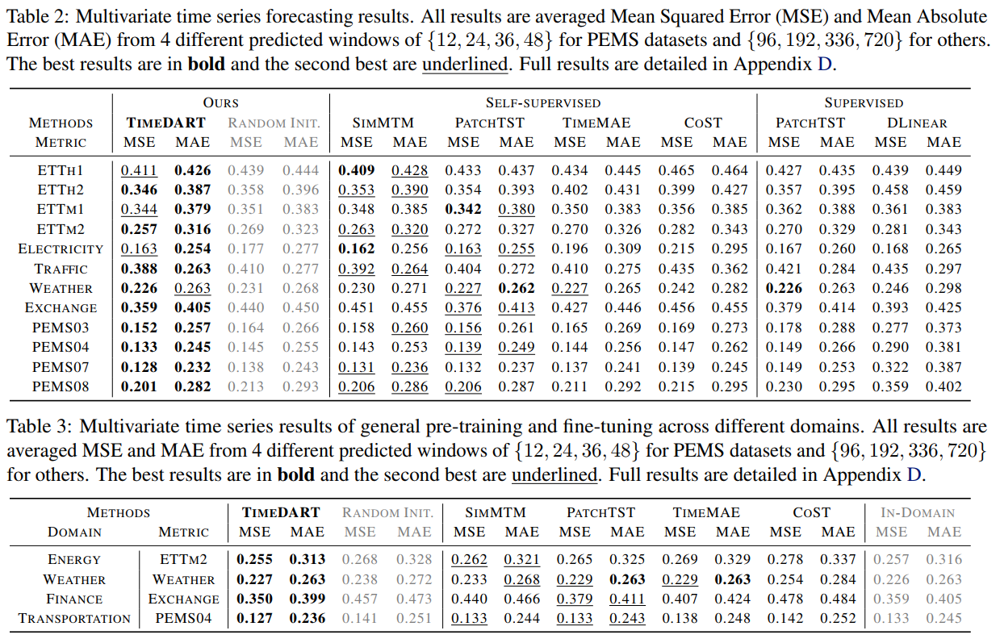
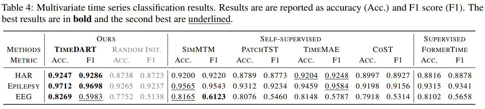

# TimeDART
This is the official PyTorch implementation of the paper: .

## Introduction

Our design philosophy centers on integrating two powerful generative approaches: auto-regressive generation and the denoising diffusion model. These two methods complement each other, each leveraging their respective strengths. Auto-Regressive Generation captures the high-level global dependencies within sequence data, while the Denoising Diffusion Model focuses on modeling lowerlevel local regions. Through their combined efforts, the model learns the deep structures and intrinsic patterns within time series data, ultimately improving prediction accuracy and generalization capability.   

The main contribution of this work can be summarized as:

- We propose a novel generative self-supervised learning framework, TimeDART, which integrates diffusion and auto-regressive modeling to effectively learn both global sequence dependencies and local detail features from time series data, addressing the challenges of capturing comprehensive temporal characteristics.

- We design a cross-attention-based denoising decoder within the diffusion mechanism, which enables adjustable optimization difficulty during the self-supervised task. This design significantly enhances the model’s ability to capture localized intra-patch features, improving the effectiveness of pre-training for time series forecasting.

- We conduct extensive experiments to validate that TimeDART achieves more superior performance on time series forecasting tasks. We also report some insight findings to understand the proposed TimeDART.



## Performance

To evaluate TimeDART, we conduct experiments on 8 popular datasets, including 4 ETT datasets (ETTh1, ETTh2, ETTm1, ETTm2), Weather, Exchange, Electricity, and Traffic. The statistics of these datasets are summarized in the following Table.

### in-domain results



### cross-domain results

We also pre-trained on five datasets (ETTh1, ETTh2, ETTm1, ETTm2, Electricity) from the Energy domain and fine-tuned on a specific dataset.



## Usage

We provide the default hyper-parameter settings in `scripts/prertrain` to perform pretraining, and ready-to-use scripts for fine-tuning on each datasets in `scripts/finetune`.

```sh
sh scripts/pretrain/ETTh2.sh && sh scripts/finetune/ETTh2.sh
```

## Acknowledgement

This repo is built on the pioneer works. We appreciate the following GitHub repos a lot for their valuable code base or datasets:

[Time-Series-Library](https://github.com/thuml/Time-Series-Library?tab=readme-ov-file)

[GPHT](https://github.com/icantnamemyself/GPHT/tree/main)

### Citation

If you find this repository useful for your work, please consider citing it as follows:

```bibtex
@misc{wang2024diffusionautoregressivetransformer,
      title={Diffusion Auto-regressive Transformer for Effective Self-supervised Time Series Forecasting}, 
      author={Daoyu Wang and Mingyue Cheng and Zhiding Liu and Qi Liu and Enhong Chen},
      year={2024},
      eprint={2410.05711},
      archivePrefix={arXiv},
      primaryClass={cs.LG},
      url={https://arxiv.org/abs/2410.05711}, 
}
```

